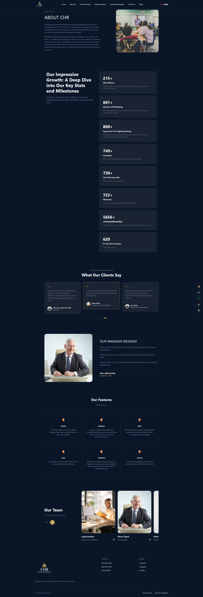
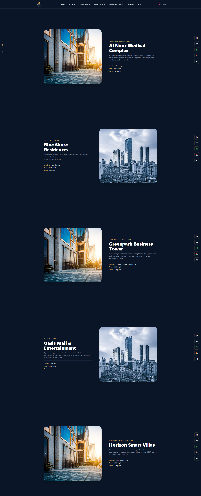
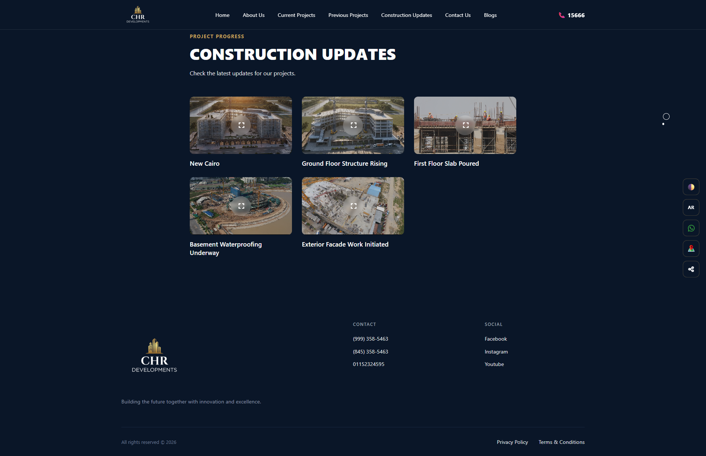
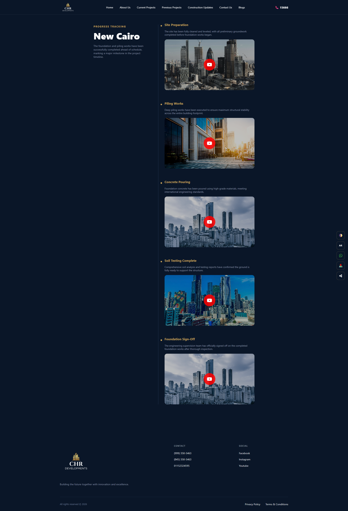
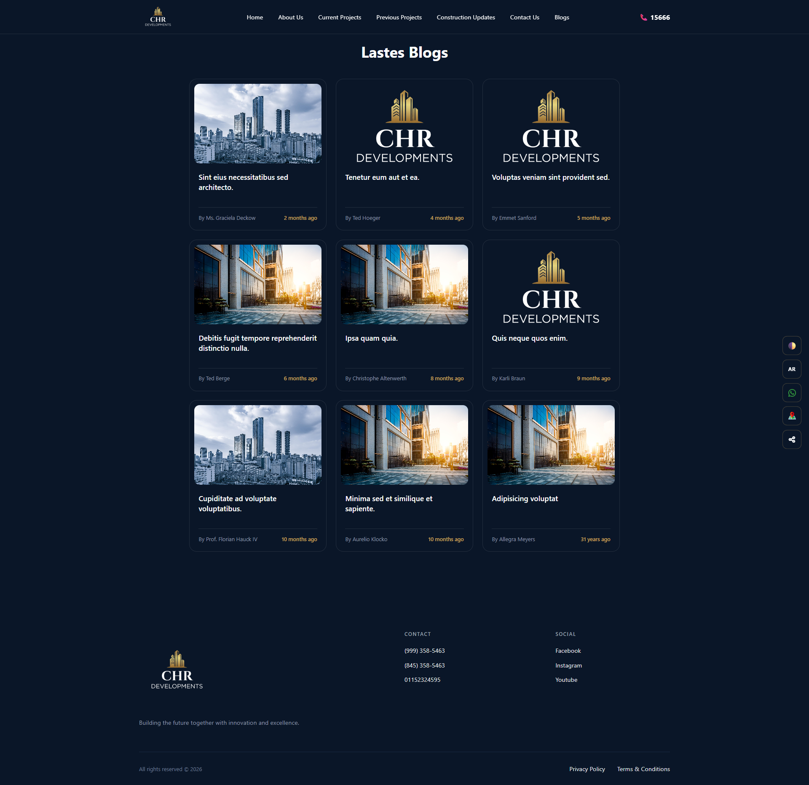
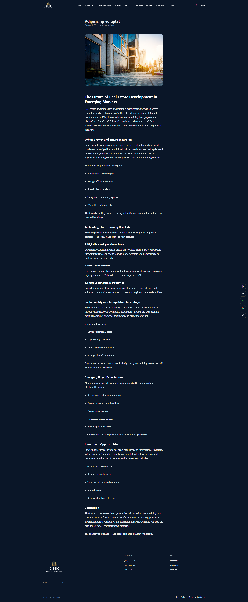
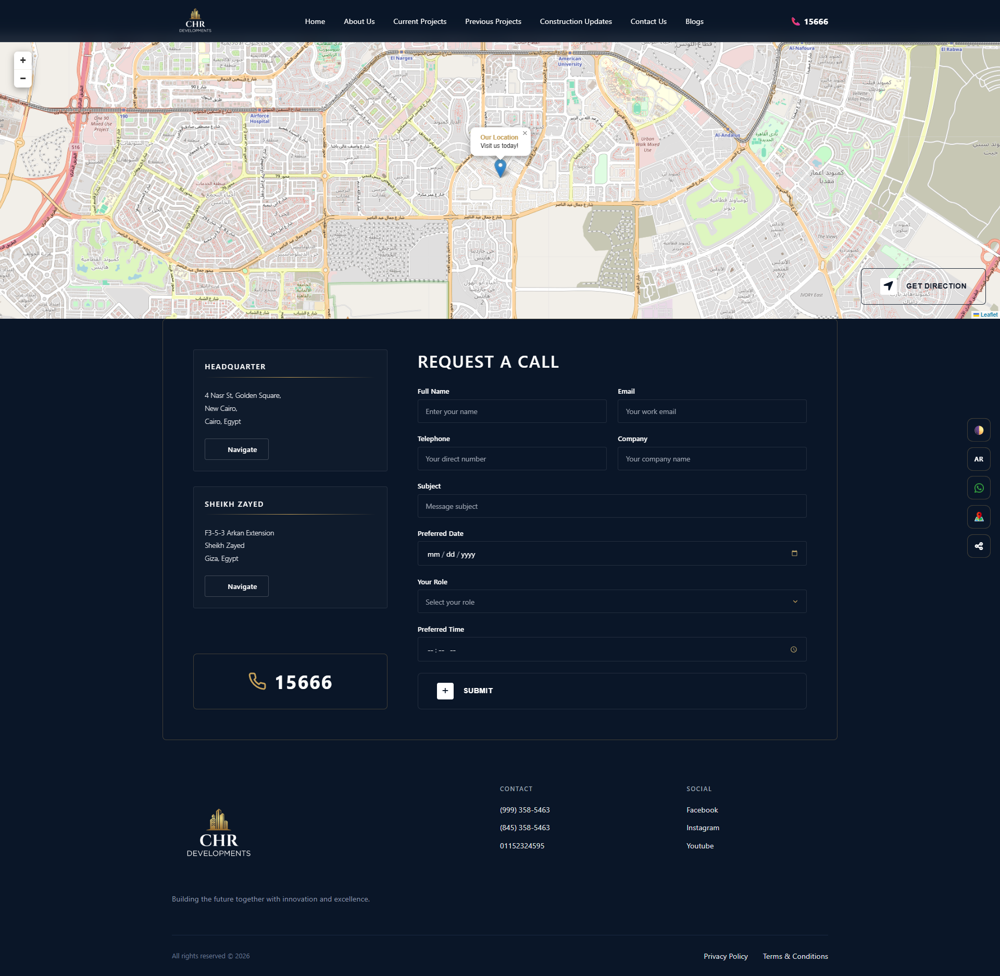

# 🏢 CHR Developments — Real Estate Company Website

<p align="center">
  
  
  
    

  
  
</p>

---

## 📖 About

**CHR Developments** is a full-stack web application built for a real estate development company. It serves as a professional digital presence showcasing current and previous projects, tracking construction progress, publishing blogs, and enabling client communication — all with a sleek dark theme and bilingual (Arabic/English) support.

> *"Building the future together with innovation and excellence."*

---

## 🎬 Demo Videos

| Home Page Tour | Project Details |
|:-:|:-:|
| [▶ Watch chr-home.mp4](screenshots/chr-home.mp4) | [▶ Watch chr-project-details.mp4](screenshots/chr-project-details.mp4) |

---

## ✨ Features

- 🏗️ **Current Projects** — Showcase ongoing real estate projects with details (location, area, status, category)
- ✅ **Previous Projects** — Portfolio of completed developments
- 📊 **Construction Updates** — Per-project progress tracking with phases, images & embedded videos
- 📝 **Blog System** — Full blog with categories, authors, dates, and rich content pages
- 📞 **Contact & Call Request** — Interactive map, multiple office locations, and a detailed call booking form
- 🌍 **Multi-Language** — Full Arabic (RTL) and English (LTR) support
- 👥 **About Us** — Company stats, team members, client testimonials, and manager message
- 📱 **Fully Responsive** — Works seamlessly across all screen sizes
- 🔔 **WhatsApp & Social Integration** — Floating quick-access social buttons

---

## 📸 Screenshots

### 🏠 About Us


### 🏗️ Current Projects


### ✅ Previous Projects


### 🔄 Construction Updates


### 📊 Construction Progress Per Project


### 📝 All Blogs


### 📖 Blog Post


### 📞 Contact Us


---

## 🛠️ Tech Stack

| Technology | Usage |
|------------|-------|
| **Laravel 11** | Backend framework (PHP) |
| **Blade** | Server-side templating engine |
| **PHP 8.x** | Core backend language |
| **MySQL** | Relational database |
| **Tailwind CSS** | Utility-first CSS framework |
| **SCSS / Sass** | Custom styling & theming |
| **JavaScript** | Frontend interactivity |
| **Vite** | Modern frontend build tool |
| **Leaflet.js** | Interactive map on Contact page |
| **Laravel Localization** | Arabic & English multi-language |

---

## 📁 Project Structure

```
chr-backend/
├── app/
│   ├── Http/
│   │   ├── Controllers/      # Page & API controllers
│   │   └── Middleware/       # Auth, locale, etc.
│   └── Models/               # Eloquent models
├── database/
│   ├── migrations/           # DB schema
│   └── seeders/              # Sample data
├── lang/
│   ├── en/                   # English translations
│   └── ar/                   # Arabic translations
├── resources/
│   ├── views/                # Blade templates
│   ├── js/                   # JavaScript files
│   └── scss/                 # SCSS stylesheets
├── routes/
│   └── web.php               # Application routes
├── public/                   # Public assets
└── vite.config.js            # Frontend build config
```
## 🎨 Theme Support

The application supports **multiple themes** that can be switched dynamically by the user.

| Theme | Description |
|-------|-------------|
| 🌑 Dark Mode | Default sleek dark theme |
| ☀️ Light Mode | Clean light theme |

Themes are applied globally using CSS custom properties (variables),
allowing instant switching without page reload.

---
## 🌍 Multi-Language Support

The app supports **Arabic (AR)** and **English (EN)**. Language can be switched via the floating `AR` button on the page. All UI strings are managed through Laravel's localization files in the `lang/` directory.

---

## 📄 Key Pages

| Page | Route | Description |
|------|-------|-------------|
| Home | `/` | Hero, highlights, featured projects |
| About Us | `/about` | Company info, stats, team, testimonials |
| Current Projects | `/current-projects` | Ongoing developments |
| Previous Projects | `/previous-projects` | Completed portfolio |
| Construction Updates | `/construction-updates` | Progress tracking per project |
| Contact Us | `/contact` | Map, offices, call request form |
| Blogs | `/blogs` | All blog posts |
| Blog Details | `/blogs/{slug}` | Single blog post |

---

## 👤 Developer

**Muhammed Ashraf Saleh**

[](https://github.com/MuhammedAshrafSaleh)

---

## 📄 License

This project is proprietary software developed for CHR Developments. All rights reserved.

---

<p align="center">Built with ❤️ using Laravel & Tailwind CSS</p>
